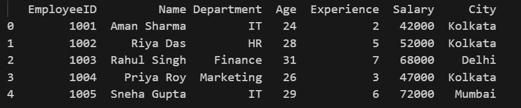
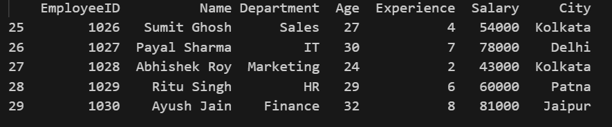
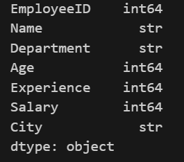
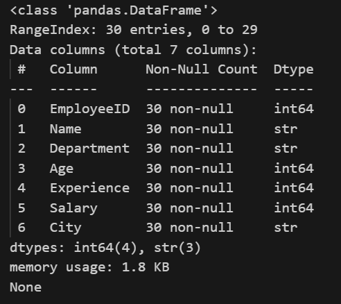
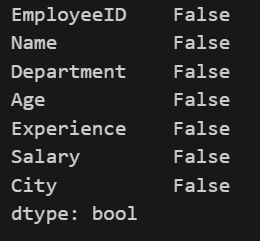
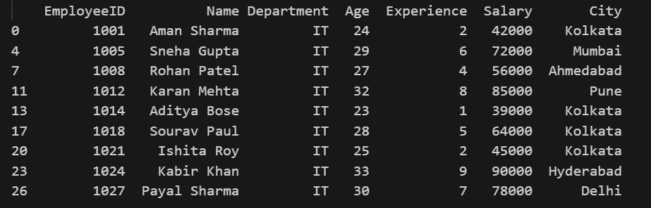
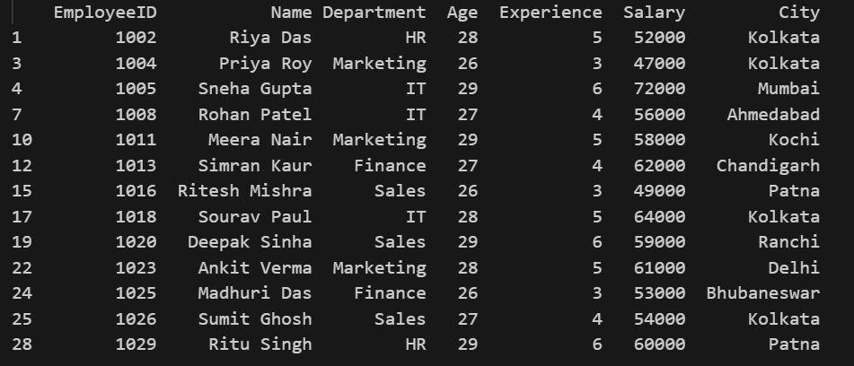

# 📊 Employee Data Analysis with Pandas

This script demonstrates basic data exploration and filtering operations using `pandas` and `numpy` on an employee dataset.

## Code

```python
import pandas as pd

df = pd.read_csv("employees.csv")
```
- `import pandas as pd` — imports pandas, the main library used for reading and manipulating tabular data.
- `df = pd.read_csv("employees.csv")` — reads the CSV file `employees.csv` into a pandas DataFrame called `df`.
---

# Different functions :
```python
print(df.iloc[0:5])
```
Prints the **first 5 rows** of the DataFrame using positional indexing (`iloc`).
<p align="center">
  
</p>

---
```python
print(df.iloc[-5:])
```
Prints the **last 5 rows** of the DataFrame using negative indexing.
<p align="center">
  
</p>

---
```python
print(df.dtypes)
```
Prints the **data type** of each column (e.g., `int64`, `object`, `float64`).

### *OUTPUT*
<p align="center">
  
</p>

---

```python
print(df.info())
```
### *OUTPUT*
Prints a full summary of the DataFrame — column names, non-null counts, data types, and memory usage.
<p align="center">
  
</p>

---
```python
print(df.shape)
```
Prints a tuple `(rows, columns)` representing the DataFrame's dimensions.

---
```python
print(df.isna().any())
```
For each column, prints `True` if **any** value is missing (`NaN`), otherwise `False`.

### *OUTPUT*
<p align="center">
  
</p>

---
```python
print(df["Name"])
```
Prints the **`Name`** column as a pandas Series.

---
```python
print(df[df["Department"] == "IT"])
```
Filters and prints all rows where the **`Department`** column equals `"IT"`.

### *OUTPUT*
<p align="center">
  
</p>

---
```python
print(df[df["Salary"] >= 70000])
```
Filters and prints all rows where **`Salary`** is greater than or equal to `70000`.

---
```python
print(df[(df["Age"] > 25) & (df["Age"] < 30)])
```
Filters and prints rows where **`Age`** is between 25 and 30 (exclusive). The `&` operator combines both boolean conditions; each condition must be wrapped in parentheses.

### *OUTPUT*
<p align="center">
  
</p>

---
```python
print("mean sal: ", df["Salary"].mean())
```
Computes and prints the **average (mean)** value of the `Salary` column.

### *OUTPUT*
<p align="center">
  
</p>

---
```python
print(df[df["Age"] == df["Age"].min()])
```
Finds the **minimum value** in the `Age` column, then filters and prints the row(s) matching that minimum — i.e., the **youngest employee**.

---
```python
print(df["Salary"].median())
```
Computes and prints the **median** of the `Salary` column — the middle value once all salaries are sorted in ascending order.
